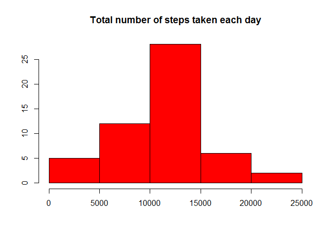
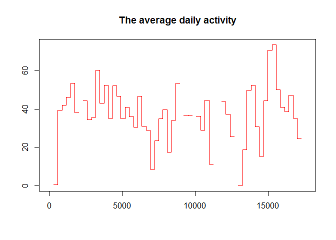
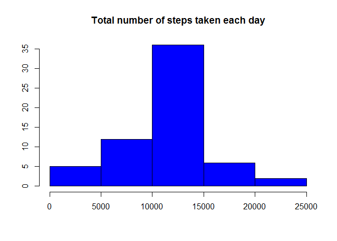
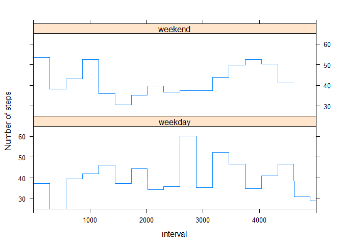

# Reproducible Research: Peer Assessment 1


## Loading and preprocessing the data

```r
setwd("C:/Users/donghoangvn/Documents/github/RepData_PeerAssessment1")
unzip("activity.zip")
datafile<-read.csv("activity.csv", header = TRUE)
names(datafile)
```

```
## [1] "steps"    "date"     "interval"
```

```r
head(datafile)
```

```
##   steps       date interval
## 1    NA 2012-10-01        0
## 2    NA 2012-10-01        5
## 3    NA 2012-10-01       10
## 4    NA 2012-10-01       15
## 5    NA 2012-10-01       20
## 6    NA 2012-10-01       25
```


## What is mean total number of steps taken per day?

```r
totalsteps<-sapply(split(datafile$steps,datafile$date),sum)
hist(totalsteps, col = "red", main = "Total number of steps taken each day", xlab = "", ylab = "")
```

 

```r
mean(totalsteps, na.rm = TRUE)
```

```
## [1] 10766.19
```

```r
median(totalsteps, na.rm = TRUE)
```

```
## [1] 10765
```


## What is the average daily activity pattern?

```r
totalsteps1<-sapply(split(datafile$steps,datafile$date),mean)
lookup1<-transform(totalsteps1)
colnames(lookup1)<-c("average")
lookup1$date<-row.names(lookup1)
datafile1<-datafile
datafile1$average<-lookup1$average[match(datafile1$date,lookup1$date)]
library(stringr)
datafile1$time<-datafile1$interval
datafile1$time<-str_pad(datafile1$time,4,pad="0")
datafile1$datetime<-paste(datafile1$date,datafile1$time,sep="-")
datafile1$datetime<-strptime(datafile1$datetime,"%Y-%m-%d-%H%M")
datafile1<-datafile1[order(datafile1[,6],decreasing=FALSE,na.last = FALSE),]
datafile1$interval<-seq(1,17568,1)
plot(datafile1$interval, datafile1$average, main = "The average daily activity", type = "l", col = "red",xlab = "", ylab = "")
```

 

```r
subset(datafile,datafile$steps==max(datafile$steps, na.rm = TRUE))
```

```
##       steps       date interval
## 16492   806 2012-11-27      615
```


## Imputing missing values

```r
summary(datafile$steps)
```

```
##    Min. 1st Qu.  Median    Mean 3rd Qu.    Max.    NA's 
##    0.00    0.00    0.00   37.38   12.00  806.00    2304
```

```r
z<-nrow(subset(datafile,is.na(datafile$steps) == TRUE))
datafill<-datafile
datafill<-datafill[order(datafill[,1],decreasing=FALSE,na.last = FALSE),]
head(datafill)
```

```
##   steps       date interval
## 1    NA 2012-10-01        0
## 2    NA 2012-10-01        5
## 3    NA 2012-10-01       10
## 4    NA 2012-10-01       15
## 5    NA 2012-10-01       20
## 6    NA 2012-10-01       25
```

```r
y<-mean(datafile$steps, na.rm = TRUE)
datafill$steps[1:z]<-rep(y,z)
head(datafill)
```

```
##     steps       date interval
## 1 37.3826 2012-10-01        0
## 2 37.3826 2012-10-01        5
## 3 37.3826 2012-10-01       10
## 4 37.3826 2012-10-01       15
## 5 37.3826 2012-10-01       20
## 6 37.3826 2012-10-01       25
```

```r
totalsteps2<-sapply(split(datafill$steps,datafill$date),sum)
hist(totalsteps2, col = "blue", main = "Total number of steps taken each day", xlab = "", ylab = "")
```

 

```r
mean(totalsteps2, na.rm = TRUE)
```

```
## [1] 10766.19
```

```r
median(totalsteps2, na.rm = TRUE)
```

```
## [1] 10766.19
```


## Are there differences in activity patterns between weekdays and weekends?

```r
datafill$date2<-datafill$date
datafill$date2<-strptime(datafill$date2,"%Y-%m-%d")
datafill$weekday<-weekdays(datafill$date2)
datafill$weekday<-replace(datafill$weekday,datafill$weekday=="Saturday","weekend")
datafill$weekday<-replace(datafill$weekday,datafill$weekday=="Sunday","weekend")
datafill$weekday<-replace(datafill$weekday,datafill$weekday!="weekend","weekday")
totalsteps3<-sapply(split(datafill$steps,datafill$date),mean)
lookup3<-transform(totalsteps3)
colnames(lookup3)<-c("average")
lookup3$date<-row.names(lookup3)
datafill$average<-lookup3$average[match(datafill$date,lookup3$date)]
library(stringr)
datafill$interval<-str_pad(datafill$interval,4,pad="0")
datafill$datetime<-paste(datafill$date,datafill$interval,sep="-")
datafill$datetime<-strptime(datafill$datetime,"%Y-%m-%d-%H%M")
datafill<-datafill[order(datafill[,5],datafill[,7],decreasing=FALSE,na.last = FALSE),]
a<-nrow(subset(datafill,datafill$weekday=="weekday"))
b<-nrow(subset(datafill,datafill$weekday=="weekend"))
datafill$interval[1:a]<-seq(1,a,1)
c<-a+1
d<-a+b
datafill$interval[c:d]<-seq(1,b,1)
library(lattice)
xyplot(average~interval|weekday,data = datafill, type="l", layout=c(1,2), xlim=c(0,5000), ylim=c(25,65), xlab = "interval",ylab = "Number of steps")
```

 

